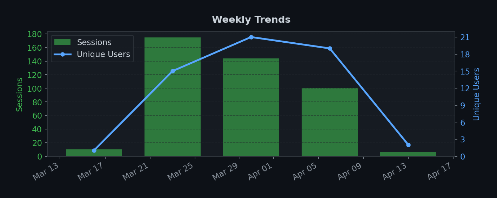
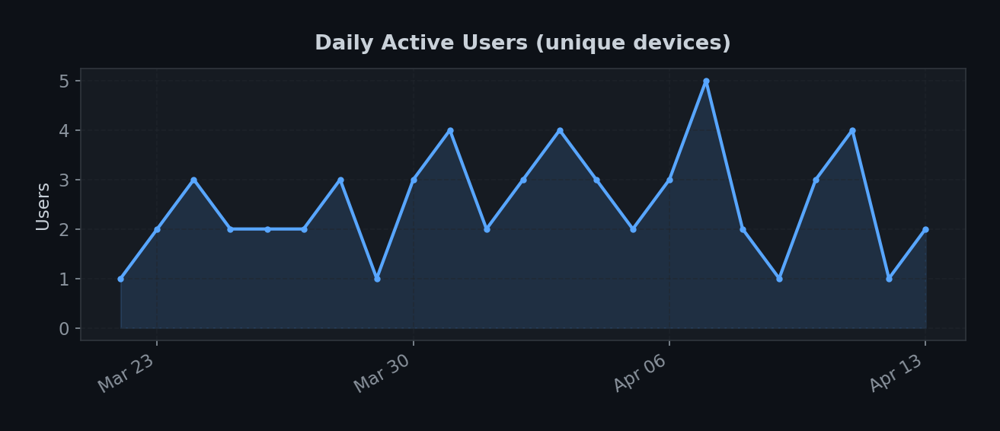
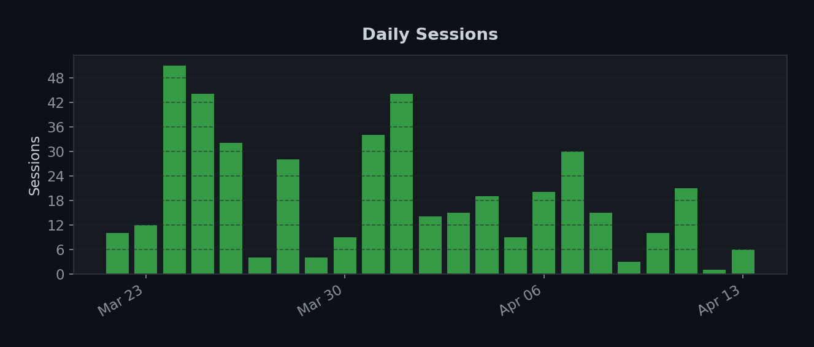
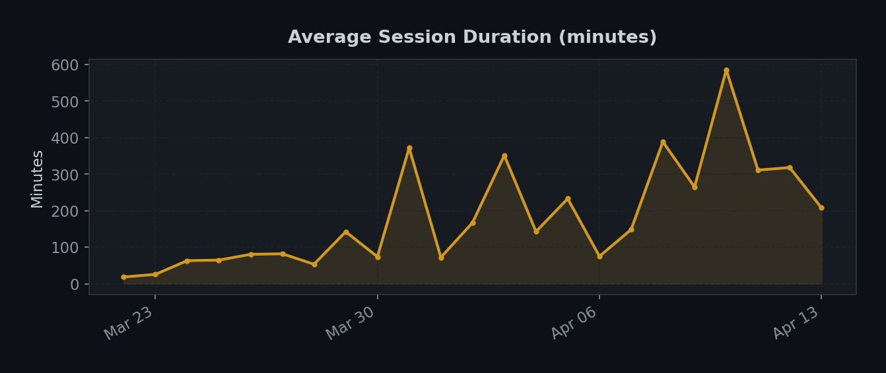
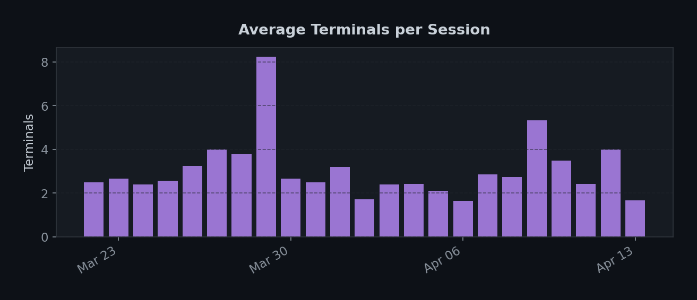
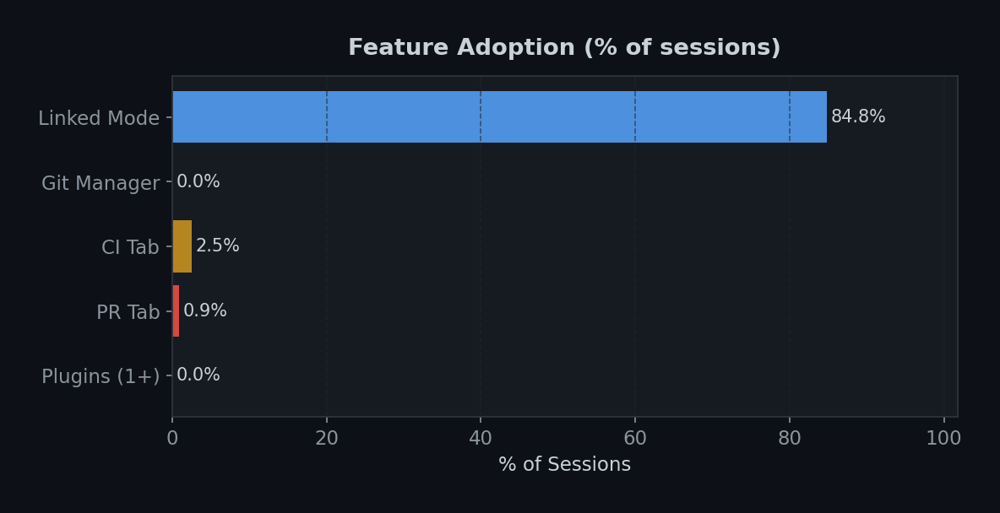
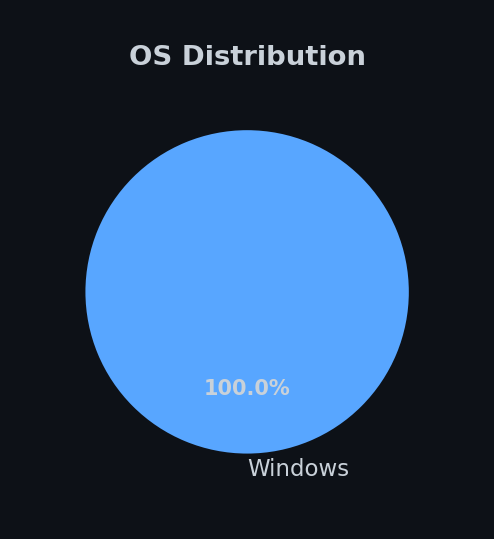
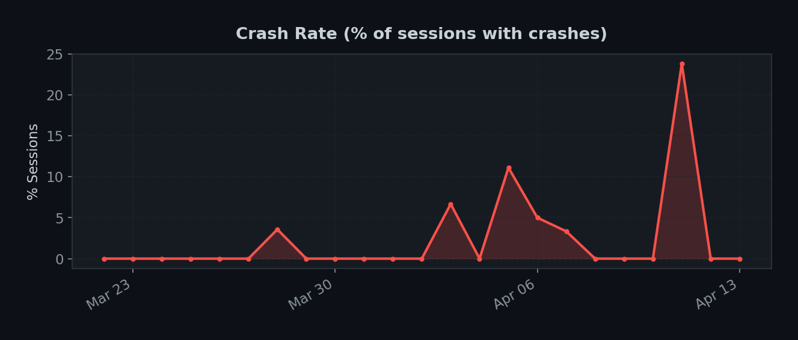
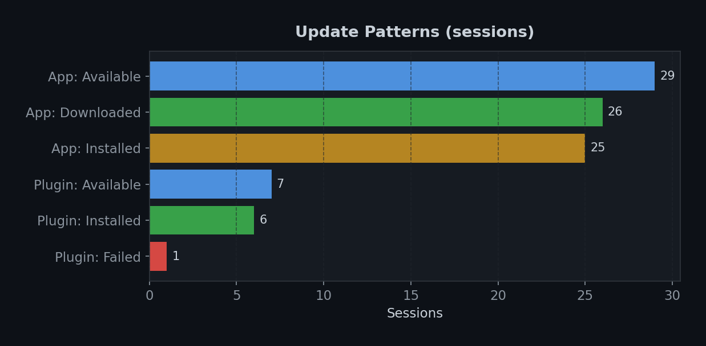

# Claude Dock Telemetry Dashboard

> Auto-generated on **2026-04-13 06:38 UTC** | Data: last 60 days (Mar 22, 2026 - Apr 13, 2026)

## Key Metrics

| Metric | Value |
|--------|-------|
| Total Sessions | **435** |
| Unique Devices | **5** |
| Avg Daily Active Users | **2.5** |
| Peak Daily Active Users | **5** |
| Avg Session Duration | **158.3 min** |
| Total Terminals Spawned | **1,202** |
| Sessions with Crashes | **10** (2.3%) |
| Days Tracked | **23** |
| Platforms | Windows: 435 |

---

## Weekly Trends

## Daily Active Users

## Daily Sessions

## Session Duration

## Terminal Usage

## Feature Adoption

## Plugin Usage

## Plugin Enabled/Disabled

## OS Distribution

## Crash Rate

## Update Patterns

---

This dashboard is updated automatically every week by a GitHub Action.
Only anonymous, aggregated telemetry is displayed. No personal data is collected or shown.
See the [Claude Dock privacy policy](https://github.com/BenDol/claude-dock) for details.
